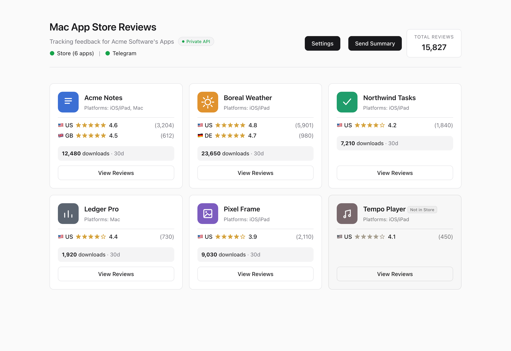
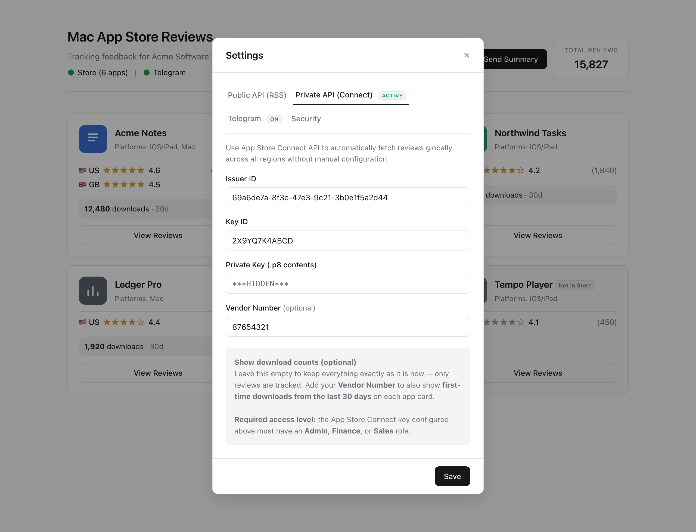
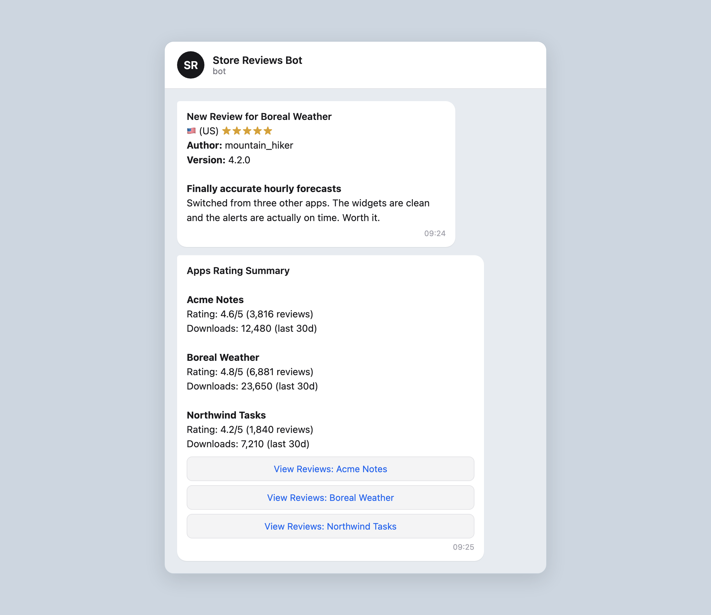

# App Store (Apple) Reviews Action & Telegram Bot

This project is a complete **Web Dashboard and Telegram Bot** designed to track Mac/iOS App Store reviews for a specific developer. It automatically scrapes Apple's servers for your apps, stores reviews in a local database (SQLite), provides a beautiful Web Dashboard, and keeps you updated via Telegram notifications.



## Data Fetching: 2 Options

The dashboard supports two different modes for fetching reviews. You can choose whichever fits your needs from the Settings menu.

### 1. Public API (RSS)
This method uses Apple's public iTunes Search and RSS feeds.
- **Pros**: Very easy to set up. Requires only your Developer Name.
- **Cons**: You must manually add each Store Region (e.g., US, UK, IL) you want to track. Unlisted/unpublished apps will not show up.
- **⚠️ Warning**: Apple's public RSS feeds are unofficial and notoriously unreliable. They frequently block or return empty review data for massive apps (like TikTok, WhatsApp). For accurate, stable data, the **Private API** is highly recommended.
- **Setup**: Just enter your exact App Store Developer Name and select the countries you want to track.

### 2. Private API (App Store Connect)
This method connects directly to your Apple Developer account securely.
- **Pros**: Automatically fetches reviews across **all global regions** without manual configuration. Also displays tags for apps that are not yet live in the store.
- **Cons**: Requires generating an API key from your Apple Developer account.
- **Setup**: See instructions below on how to obtain your API key.



### How to get your App Store Connect Private Key
To use the Private API, you need to generate an API key from App Store Connect:
1. Log in to [App Store Connect](https://appstoreconnect.apple.com/).
2. Navigate to **Users and Access** > **Integrations** > **App Store Connect API**.
3. Click the **+** button to generate a new API Key.
4. Give it a name (e.g., "Store Reviews Bot") and assign it the **App Manager** or **Admin** access role.
5. Click **Generate**.
6. Note the **Issuer ID** at the top of the page, and the **Key ID** next to your new key.
7. Click **Download API Key** to download the `.p8` file.
8. Open the `.p8` file in any text editor, and copy its entire contents (including the `BEGIN PRIVATE KEY` lines) into the Web Dashboard settings.

---

## Telegram Integration (Core Feature)

One of the main strengths of this system is its deep Telegram integration, allowing you to stay connected to your user feedback from anywhere. 



There are two distinct types of Telegram interactions:

### 1. Automated Push Notifications (Active)
The system runs silently in the background, checking the App Store at regular intervals (default: every hour — configurable from the Settings window, and applies to both Public and Private API modes). 
- Whenever a **brand new review** is published for any of your apps, the bot will automatically send a **push notification** directly to your Telegram chat.
- The notification includes the app's official icon, the star rating, the author's name, the app version, and the full text of the review.
- You do not need to do anything to trigger this; it happens entirely automatically.

### 2. 📊 On-Demand Summaries (Manual)
If you want to quickly check the current status of your apps without waiting for a new review, you can manually request a summary:
- **How to trigger**: Click the "Send Summary" button on the Web Dashboard, or simply type `/apps` in your Telegram chat with the bot.
- **What you get**: The bot will reply with a clean summary listing all your apps, their average ratings, and total review counts.
- **Interactive Buttons**: Below the summary, the bot attaches inline buttons for each app. Clicking an app's button will instantly reply with its **last 5 reviews**.

---

## 💻 Web Dashboard

The project includes a sleek, modern web interface accessible from your browser (e.g., `http://localhost:3000`).
- **Apps Grid**: Displays a card for each of your apps, showing its icon, name, average rating, and total review count.
- **Reviews Modal**: Click on any app to open a scrollable window containing all its saved reviews.
- **In-Browser Settings**: A built-in Settings modal allows you to configure your APIs and Telegram Bot securely from the UI.
- **Security & Authentication**: You can secure your dashboard with a custom username and password from the "Security" tab in the Settings. When enabled, a beautifully integrated Login Modal prevents unauthorized access to your dashboard and APIs.
  - *Forgot your password?* Your credentials are saved securely in a local JSON file (`data/auth.json`) that is never tracked by Git. If you get locked out, you can access your server's terminal and run `cat data/auth.json` to view your current credentials, or simply run `rm data/auth.json` to delete the password requirement completely.

---

## 🛠 Setup Instructions

### 1. Install & Run
1. Open your terminal in the project folder and install dependencies:
   ```bash
   npm install
   ```
2. Start the server:
   ```bash
   npm start
   ```
3. Open your browser and navigate to `http://localhost:3000`.

### 2. Configure Telegram (via Web UI)
1. In the Web Dashboard, click the **Settings** button at the top right, and go to the **Telegram** tab.
2. Create a bot via **@BotFather** on Telegram to get your **Bot Token**.
3. Use a bot like **@userinfobot** to find your numeric **Chat ID**.
4. Enter both into the settings window and click "Save".

*(Note: The system saves these settings persistently in a local database. You only need to configure them once).*

## Technical Overview

- **`scraper.js`**: Connects to the iTunes Search API, RSS feeds, and App Store Connect API to fetch apps, ratings, and reviews. 
- **`telegram.js`**: Manages the Telegram bot lifecycle, polling, inline keyboards, and automated photo/text messages.
- **`db.js`**: Handles the local SQLite database (`data/reviews.sqlite`), storing persistent settings and preventing duplicate reviews.
- **`server.js`**: The Express server that orchestrates the backend, serves the frontend UI, and runs the background scraping loops.
